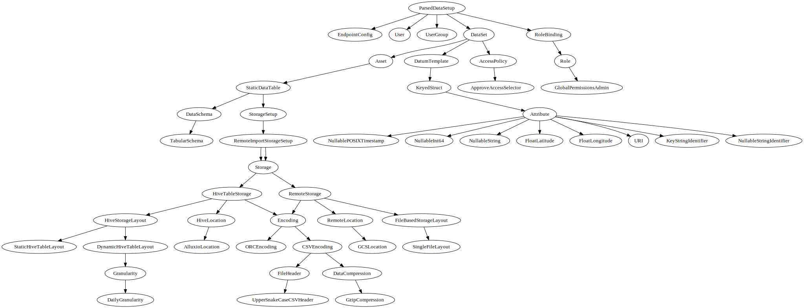
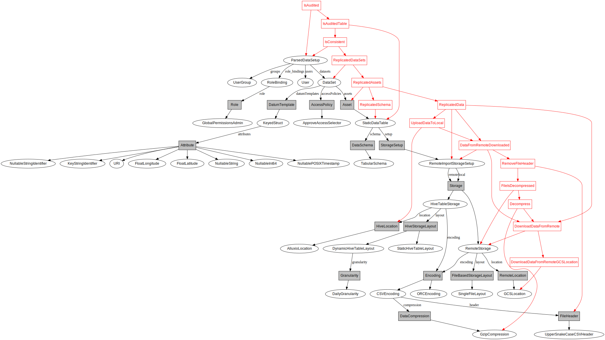
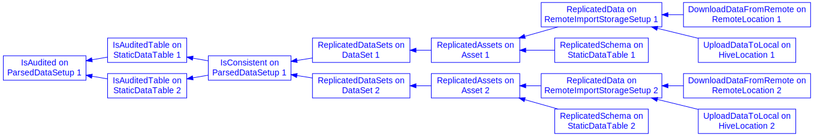

# Aorist

Aorist is a code-generation tool for MLOps. Its aim is to generate legible
code for common repetitive tasks in data science, such as data replication,
common transformations, as well as machine learning operations.

## How to install

These instructions require [Anaconda](https://anaconda.org) and were tested
against Ubuntu Linux 20.04 LTS.

```
conda create -n aorist python=3.8 anaconda
conda activate aorist
pip install https://storage.googleapis.com/scienz-artifacts/aorist-0.0.1-cp38-cp38-manylinux2010_x86_64.whl

# Try it out
python example/gen.py python
python example/gen.py jupyter
python example/gen.py airflow
```

## Overview of an Aorist universe

Let's say we are starting a new project which involves analyzing a number of
large graph datasets, such as the ones provided by the
[SNAP](snap.stanford.edu) project.

We will conduct our analysis in a mini data-lake, such as the
[Trino](trino.io) + [MinIO](min.io) solution specified by
[Walden](https://github.com/scie-nz/walden).

We would like to replicate all these graphs into our data lake before we
can start analyzing them. At a very high-level, this is achieved by defining
a "universe", the totality of things we care about in our project. One such
universe is specified below:

```python
from snap import snap_dataset
from aorist import (
    dag,
    Universe,
    ComplianceConfig,
    HiveTableStorage,
    MinioLocation,
    StaticHiveTableLayout,
    ORCEncoding,
)
from common import DEFAULT_USERS, DEFAULT_GROUPS, DEFAULT_ENDPOINTS

universe = Universe(
    name="my_cluster",
    datasets=[
        snap_dataset,
    ],
    endpoints=DEFAULT_ENDPOINTS,
    users=DEFAULT_USERS,
    groups=DEFAULT_GROUPS,
    compliance=ComplianceConfig(
        description="""
        Testing workflow for data replication of SNAP data to
        local cluster. The SNAP dataset collection is provided
        as open data by Stanford University. The collection contains
        various social and technological network graphs, with
        reasonable and systematic efforts having been made to ensure
        the removal of all Personally Identifiable Information.
        """,
        data_about_human_subjects=True,
        contains_personally_identifiable_information=False,
    ),
)
```

The universe definition contains a number of things:
- the datasets we are talking about (more about it in a bit),
- the endpoints we have available (e.g. the fact that a MinIO server
  is available for storage, as opposed to HDFS or S3, etc., and where
  that server is available; what endpoint we should use for Presto /
  Trino, etc.)
- who the users and groups are that will access the dataset,
- some compliance annotations.

Note: Currently users, groups, and compliance annotations are supported as a
proof of concept -- these concepts are not essential to an introduction
so we will skip them for now.

## Generating a DAG

To generate a flow that replicates our data all we have to do is run:

```python
DIALECT = "python"
out = dag(
  universe, [
    "DataDownloadedAndConverted",
  ], DIALECT
)
```
This will generate a set of Python tasks, which will do the following, for
each asset (i.e., each graph) in our dataset:

- download it from its remote location,
- decompress it, if necessary
- remove its header,
- convert the file to a CSV, if necessary
- upload the CSV data to MinIO
- create a Hive table backing the MinIO location
- convert the CSV-based Hive table to an ORC-based Hive table
- drop the temporary CSV-based Hive table

This set of tasks is also known as a Directed Acyclic Graph (DAG).
The same DAG can be generated as a Jupyter notebook, e.g. by setting:
```python
DIALECT = "jupyter"
```
Or we can set `DIALECT` to `"airflow"` for an Airflow DAG.

## Describing a dataset

Before we can turn our attention to what we would like to achieve with
our data, we need to determine what the data *is*, to begin with. We do
so via a dataset manifest, which is created using Python code.

Here's an example of how we'd create such a manifest for a canonical ML dataset
(the Wine dataset, as per `example/wine.py`).

First, we define our attribute list:
```python
attributes = attr_list([
    attr.Categorical("wine_class_identifier"),
    attr.PositiveFloat("alcohol"),
    attr.PositiveFloat("malic_acid"),
    attr.PositiveFloat("ash"),
    attr.PositiveFloat("alcalinity_of_ash"),
    attr.PositiveFloat("magnesium"),
    attr.PositiveFloat("total_phenols"),
    attr.PositiveFloat("non_flavanoid_phenols"),
    attr.PositiveFloat("proanthocyanins"),
    attr.PositiveFloat("color_intensity"),
    attr.PositiveFloat("hue"),
    attr.PositiveFloat("od_280__od_315_diluted_wines"),
    attr.PositiveFloat("proline"),
])
```

Then, we express the fact that a row corresponds to a struct
with the fields defined in the `attributes` list:
```python
wine_datum = RowStruct(
    name="wine_datum",
    attributes=attributes,
)
```

Then, we declare that our data can be found somewhere on the Web, in
the `remote` storage. Note that we also record the data being CSV-encoded,
and the location corresponding to a single file. This is where we could
note compression algorithms, headers, etc.:
```python
remote = RemoteStorage(
    location=WebLocation(
        address=("https://archive.ics.uci.edu/ml/"
                 "machine-learning-databases/wine/wine.data"),
    ),
    layout=SingleFileLayout(),
    encoding=CSVEncoding(),
)
```

We need this data to live locally, in a Hive table in ORC format, backed
by a MinIO location with the prefix `wine`:
```python
local = HiveTableStorage(
    location=MinioLocation(name="wine"),
    layout=StaticHiveTableLayout(),
    encoding=ORCEncoding(),
)
```
Note a few things:
- we don't specify the table name, as this is automatically-generated from the
  asset name (we will define that momentarily)
- we declare, "this thing needs to be stored in MinIO", but do not concern
  ourselves with endpoints at this moment. Aorist will find the right endpoints
  for us and fill in secrets, etc. Or if MinIO is unavailable it will fail.
- this is also where we can indicate whether our table is static (i.e. there is
  no time dimension, or dynamic).

We are now ready to define our asset, called `wine_table`:
```python
wine_table = StaticDataTable(
    name="wine_table",
    schema=default_tabular_schema(wine_datum),
    setup=RemoteImportStorageSetup(
        tmp_dir="/tmp/wine",
        remote=remote,
        local=[local],
    ),
    tag="wine",
)
```
Here's what we do here:
  - we define an asset called `wine_table`. This is also going to be the name
  of any Hive table that will be created to back this asset (or file, or
  directory, etc., depending on the dataset storage.
  - we also define a schema. A schema tells us *exactly* how we can turn a row
  into a template. For instance, we need the exact order of columns in a row
  to know unambiguously how to convert it into a struct.
  - `default_tabular_schema` is a helper function that allows us to derive a
  schema where columnns in the table are in exactly the same order as fields in
  the struct.
  - the `setup` field introduces the notion of a "replicated" remote storage,
    via `RemoteImportStorageSetup`. The idea expressed here is that we should
    make sure the data available at the `remote` location is replicated exactly
    in the `local` locations (either by copying it over, or, if already
    availalbe, by checking that the remote and target data has the same
    checksum, etc.)
  - we also use a `tag` field to help generate legible task names and IDs
    (e.g., in Airflow)

Finally, let's define our dataset:

```
wine_dataset = DataSet(
    name="wine",
    datumTemplates=[wine_datum],
    assets={"wine_table": wine_table},
)
```
This dataset can then be imported into the universe discussed previously.

### Aside: The asset / template split

An Aorist dataset is meant to be a collection of two things:
- data *assets* -- concrete information, stored in one or multiple locations,
  remotely, on-premise, or in some sort of hybrid arrangement.
- datum *templates* -- information about what an instance of our data (i.e., a
  *datum*) represents.


For instance, a table is a data asset. It has rows and columns, and those rows
and columns are filled with some values that can be read from some location.

What those rows and columns *mean* depends on the template. Oftentimes rows in
tables translate to structs, for instance in a typical `dim_customers` table.
But if we're talking about graph data, then a row in our table represents a
tuple (more specifically a pair), and not a struct.

Other examples of data assets would be:
- directories with image files,
- concrete machine learning models,
- aggregations,
- scatterplots,

Other examples of data templates could be:
- a tensor data template corresponding to RGB images,
- an ML model template that takes a certain set of features (e.g. number of
  rooms and surface of a house, and produces a prediction, e.g. a valuation),
- a histogram data template, expressing the meaning of margin columns used for
  aggregations, as well as the aggregation function (a count for a histogram)
- a scatterplot template, encoding the meaning of the x and y axis, etc.

This conceptual differentiation allows us to use the same template to refer to
multiple assets. For instance, we may have multiple tables with exactly the
same schema, some being huge tables with real data, and others being
downsampled tables used for development. These tables should be refered to
using the same template.

## Back to the SNAP dataset

The SNAP dataset we discussed initially is a bit different from the simple Wine
dataset. For one, it contains many assets -- this is a collection of different graphs
used for Machine Learning applications -- each graph is its own asset. But the
meaning of a row remains the same: it's a 2-tuple made up of identifiers. We
record this by defining the template:
```python
edge_tuple = IdentifierTuple(
    name="edge",
    attributes=attr_list([
        attr.NumericIdentifier("from_id"),
        attr.NumericIdentifier("to_id"),
    ]),
)
```

Then we define an asset for each of 12 datasets. Note that the names come from
the URL patterns corresponding to each dataset. We need to replace dashes with
underscores when creating asset names however (Hive tables don't like dashes
in their names):
```python
names = [
    "ca-AstroPh", "ca-CondMat", "ca-GrQc", "ca-HepPh",
    "ca-HepTh", "web-BerkStan", "web-Google", "web-NotreDame",
    "web-Stanford", "amazon0302", "amazon0312", "amazon0505",
]
tables = {}
for name in names:

    name_underscore = name.replace("-", "_").lower()
    remote = RemoteStorage(
        location=WebLocation(
            address="https://snap.stanford.edu/data/%s.txt.gz" % name,
        ),
        layout=SingleFileLayout(),
        encoding=TSVEncoding(
            compression=GzipCompression(),
            header=UpperSnakeCaseCSVHeader(num_lines=4),
        ),
    )
    local = HiveTableStorage(
        location=MinioLocation(name=name_underscore),
        layout=StaticHiveTableLayout(),
        encoding=ORCEncoding(),
    )
    table = StaticDataTable(
        name=name_underscore,
        schema=default_tabular_schema(edge_tuple),
        setup=RemoteImportStorageSetup(
            tmp_dir="/tmp/%s" % name_underscore,
            remote=remote,
            local=[local],
        ),
        tag=name_underscore,
    )
    tables[name] = table

snap_dataset = DataSet(
    name="snap",
    datumTemplates=[edge_tuple],
    assets=tables,
    tag="snap",
)
```

## What if we want to do Machine Learning?

As a proof-of-concept, ML models are not substantively different from
tabular-based data assets. Here's an example for how we can declare the
existence of an SVM regression model trained on the wine table:

```python
# We will train a classifier and store it in a local file.
classifier_storage = LocalFileStorage(
    location=MinioLocation(name="wine"),
    layout=SingleFileLayout(),
    encoding=ONNXEncoding(),
)
# We will use these as the features in our classifier.
features = attributes[2:10]
# This is the "recipe" for our classifier.
classifier_template = TrainedFloatMeasure(
    name="predicted_alcohol",
    comment="""
    Predicted alcohol content, based on the following inputs:
    %s
    """ % [x.name for x in features],
    features=features,
    objective=attributes[1],
    source_asset_name="wine_table",
)
# We now augment the dataset with this recipe.
wine_dataset.add_template(classifier_template)
# The classifier is computed from local data
# (note the source_asset_names dictionary)
classifier_setup = ComputedFromLocalData(
    source_asset_names={"training_dataset": "wine_table"},
    target=classifier_storage,
    tmp_dir="/tmp/wine_classifier",
)
# We finally define our regression_model as a concrete
# data asset, following a recipe defined by the template,
# while also connected to concrete storage, as defined
# by classifier_setup
regression_model = SupervisedModel(
    name="wine_alcohol_predictor",
    tag="predictor",
    setup=classifier_setup,
    schema=classifier_template.get_model_storage_tabular_schema(),
    algorithm=SVMRegressionAlgorithm(),
)
wine_dataset.add_asset(regression_model)
```

Note the use of imperative directives such as `wine_dataset.add_asset`. This is
a small compromise on our mostly-declarative syntax, but it maps well on the
following thought pattern common to ML models:
- we have some "primary sources", datasets external to the project,
- we then derive other data assets by building, iteratively on the primary
  sources.

The common development cycle, therefore, is one where, after the original data
sources are imported, we add new templates and assets to our dataset,
fine-tuning Python code by first running it in Jupyter, then in Native python,
then as an Airflow task, etc.

Also note that while currently Aorist only supports generating single files as
DAGs, in the future we expect it will support multiple file generation for
complex projects.

## How to build

To build cargo library (need Rust installed):

```
cargo build
```

To try out Python code against .so library:

```
./run.sh
```

To rebuild pip wheel (requires [maturin](https://github.com/PyO3/maturin)):
```
maturin build
```

# Internals

Aorist's "secret sauce" is a Rust core. Even though we usually interact with
Aorist via Python, deep down we rely on Rust's efficiency and type-safety to
help us deal with the impressive complexity of data tasks. The following notes
deal with some of the core concepts in Aorist. They are still Work-in-Progress.

## Concepts
Aorist uses two types of concepts:
- abstract concepts (e.g. a "location")
- concrete ones (e.g. "a Google Cloud Storage location", or `GCSLocation`).

The relationship between abstract concepts represents the core semantic model offered by Aorist. This is not expected to change on a regular basis. Ideally this would not change at all.

Concrete concepts "instantiate" abstract ones, much like classes can instantiate traits or interfaces in OOP languages (in fact, this is how concrete concepts are implemented in Aorist).

Abstract concepts have the following hierarchy:

- `Universe`: the core Aorist abstraction, one per project
  - `DataSet`:  a universe of instantiated objects which have inter-related schemas
  - `User`:  someone accessing the objects
  - `Group`:  a group of users
  - `Roles`:  a way in which a user may access data.
  - `RoleBindings`:  a connection between users and roles

Here is the current hierarchy of Aorist concepts:



## Constraints

A constraint is a fact that can be verified about a concept.
A constraint may have dependent constraints. For instance, we may have
the constraint "is consistent" on `Universe`, that further breaks down into:
- "datasets are replicated",
- "users are instantiated",
- "role bindings are created",
- "data access policies are enforced".

Dependent constraints simply tell us what needs to hold, in order for a constraint
to be true. Dependent constraints may be defined on the same concept, on
dependent concepts, or on higher-order concepts, but they may not create a
cycle. So we cannot say that constraint A depends on B, B depends on C, and C
depends on A.

This is quite dry stuff. Here is a diagram of an example set of constraints to
help better visualize what's going on:




When dependent constraints are defined on lower-order concepts, we will consider
the dependency to be satisfied when *ALL* constraints of the dependent kind
associated with the lower-order concepts directly inheriting from the
constrained concept have been satisfied.

For instance we may say that a constraint placed on the Universe (our
abstraction for a Data Warehouse or Data Lake), of the kind: "no columns
contain PII" is to be satisfied when all columns in *ALL* the tables are
confirmed to not contain any PII.

When dependent constraints are defined on higher-order concepts, we will
consider the dependency to be satisfied when the dependent constraint placed on
the exact higher-order ancestor has been satisfied.

So for instance, a model trained on data from the data warehouse may be
publishable on the web if we can confirm that no data in the warehouse
whatsoever contains any PII. This is a very strict guarantee, but it is
logically correct -- if there is no PII in the warehouse, there can be no PII
in the model. This is why we could have a constraint at the model-level that
depends on the Universe-level "no PII" constraint.

## Constraint DAG generation

Both constraints and concept operate at a very abstract level. They are basic
semantic building blocks of how we understand the things we care about in our
data streams. But our YAML file will define ``instances'' of concepts, i.e.,
Aorist **objects**. `StaticDataTable` is a concept, but we may have 200 static
data tables, on which we would like to impose the same constraints. For
instance, we would like all these tables to be audited, etc.[1]

Looking back at the concept hierarchy mentioned above, we turn the constraint
DAG into the prototype of an ETL pipeline by "walking" both the concept
(black) and constraint (red) part of the DAG.

Here's what the Constraint DAG looks like



[1] (NOTE: in the future we will support filters on constraints, but for now
assume that all constraints must hold for all instances).

Some things to note about this DAG:
- it includes some superfluous dependencies, such as the one between
`DownloadDataFromRemote` and `ReplicatedData`
- some constraints are purely "cosmetic" -- `DataFromRemoteDownloaded` is
  really just a wrapper around `DownloadDataFromRemote` that "elevates" it to
  the root level, so that `UploadDataToLocal` can depend on it.

## Programs

Constraints are satisfiable in two stages:
1. First, any dependent constraints must be satisfied.
2. Then, a program associated with the constraint must run successfully.

The program is where the actual data manipulation happens. Examples of programs
are: "move this data from A to B", or "train this model", or "anonymize this
data," etc. The programs are written as templates, with full access to the
instantiated object hierarchy.

A program is written in a "dialect" that encompases what is considered to be
valid code. For instance, "Python3 with numpy and PyTorch" would be a dialect.
For Python dialects, we may attach a conda `requirements.txt` file, or a Docker
image to the dialect, etc. For R dialects we may attach a list of libraries and
an R version, or a Docker image.

## Drivers

Note that multiple programs may exist that could technically satisfy a
constraint. A **driver** decides which program to apply (given a preference
ordering) and is responsible for instantiating it into valid code that will run
in the specific deployment. A driver could, for instance, be responsible for
translating the constraint graph into valid Airflow code that will run in a
particular data deployment, etc.
# aorist-dags
